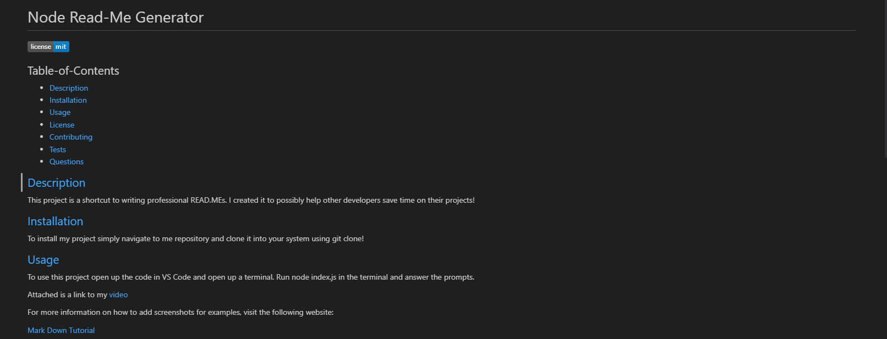

# Node Read-Me Generator

  

  ## Table-of-Contents

  * [Description](#description)
  * [Installation](#installation)
  * [Usage](#usage)
  * [License](#license)
  * [Contributing](#contributing)
  * [Tests](#tests)
  * [Questions](#questions)
  
  ## [Description](#table-of-contents)

  This project is a shortcut to writing professional READ.MEs. I created it to possibly help other developers save time on their projects!

  ## [Installation](#table-of-contents)

  To install my project simply navigate to me repository and clone it into your system using git clone! 

  ## [Usage](#table-of-contents)

  To use this project open up the code in VS Code and open up a terminal. Run node index.js in the terminal and answer the prompts.
  
  Attached is a link to my [video](https://drive.google.com/file/d/19HrfjSZKbomDKEHGZTETD1kwUcqPM_2E/view)

  Below is a screenshot of the generated README
  
  
  For more information on how to add screenshots for examples, visit the following website:
  
  [Mark Down Tutorial](https://agea.github.io/tutorial.md/)
  
  ## [License](#table-of-contents)
  The application is covered under the following license: [mit](https://choosealicense.com/licenses/mit)

  ## [Contributing](#table-of-contents)
  
  No Collaborators. Using Inquirer npm.

  ## [Tests](#table-of-contents)

  To test my app simply run through the prompts!

  ## [Questions](#table-of-contents)

  Please contact me using the following links:

  [GitHub](https://github.com/info-hazard)

  [Email: zachakazach@gmail.com](mailto:zachakazach@gmail.com)
